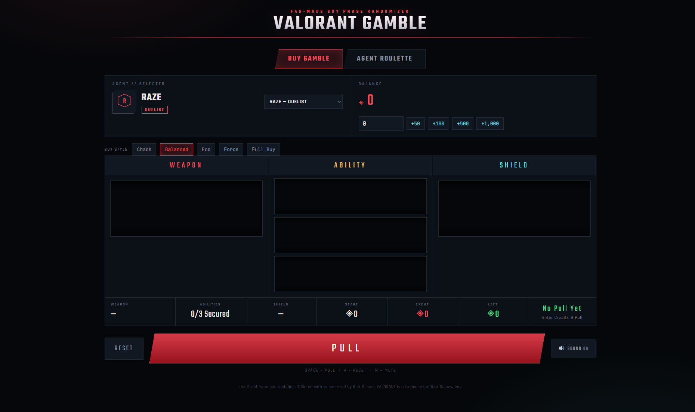

VALORANT GAMBLE 🎰

A fan-made Valorant-inspired random buy generator and Agent Roulette designed to make your next Valorant game more unpredictable and fun.

Enter your available Credits, choose your Agent, and let the Buy Gamble decide what you should purchase. You can also spin the Agent Roulette to randomly select an Agent to play.

## 🚀 Live Demo

👉 **[Try VALORANT GAMBLE](https://your-netlify-site.netlify.app/)**

## 📸 Preview

⚠️ This is a fan-made project and is not affiliated with or endorsed by Riot Games.

✨ Features
🎰 Buy Gamble
Enter your available Credits.
Select your Agent.
Generate a randomized weapon.
Randomize your abilities.
Randomize your shield choice.
Automatically calculate:
Total cost
Credits spent
Credits remaining
Only recommends purchases that fit within your available Credits.
Slot-machine-inspired spinning animations.
Reset and spin again whenever you want.
⭐ Agent-Specific Ability Logic

The randomizer supports different Agent ability mechanics.

For example, Astra uses a Star-based system:

5 total Stars
1 free Star
Additional Stars cost Credits
Abilities consume Stars instead of having individual purchase costs

This allows the randomizer to handle Agent-specific purchase mechanics rather than treating every Agent's abilities identically.

🎯 Agent Roulette

Can't decide which Agent to play?

Use the Agent Roulette to randomly select one for you.

Random Agent selection
Agent portraits
Agent roles
Roulette-style animation
Spin again functionality
Selected Agent result card
📱 Responsive Design

The application is designed to work across:

🖥️ Desktop
💻 Laptop
📱 Mobile
📱 Small-screen devices

The mobile layout adapts the slot-machine reels, controls, credits section, summary, and Agent Roulette for touch-friendly use.

🛠️ Built With
HTML5
CSS3
JavaScript
Responsive CSS
CSS Animations
🎮 How to Use
1. Enter Your Credits

Enter the amount of Credits you currently have available for the round.

2. Select Your Agent

Choose the Agent you're playing.

3. Pull the Gamble

Click PULL to generate a randomized buy recommendation.

The system will generate a loadout based on your available Credits.

4. Check Your Buy

Review:

Weapon
Abilities
Shield
Total Cost
Credits Remaining
5. Try Agent Roulette

Switch to Agent Roulette and spin the wheel if you want a random Agent to play.

⚠️ Disclaimer

This project is a fan-made, non-commercial project inspired by Valorant.

Valorant and related game assets, characters, names, and trademarks belong to Riot Games. This project is not affiliated with, sponsored by, or endorsed by Riot Games.

